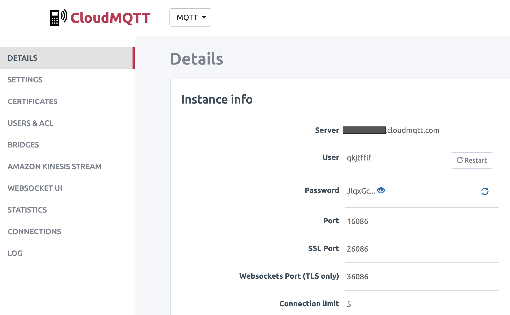
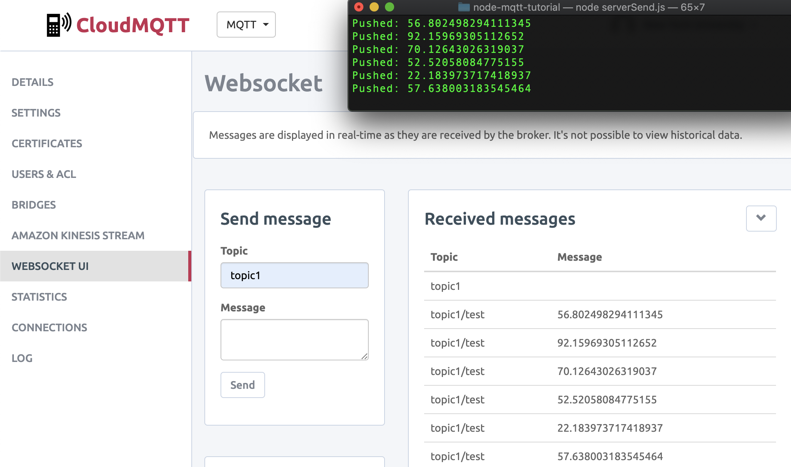
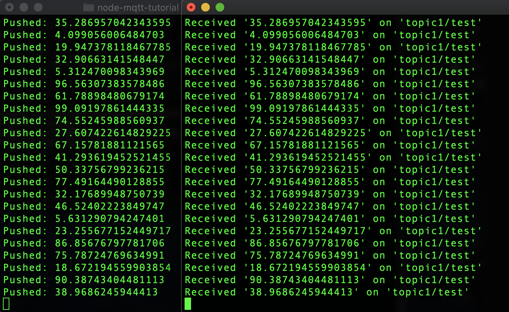

# Communication System with Node.js and MQTT

## Introduction
This tutorial uses **Node.js** and **MQTT** to create a communication system with clients and a main broker. The level is intended for users that have a basic understanding of **JavaScript**, and ideally prior knowledge with Node.js.

## MQTT Broker Set Up
**[MQTT](http://mqtt.org/)** is a lightweight communication protocol optimized for **Internet of Things** applications, and it allows the development and control of networks, and interconnected devices. It uses a **publish/subscribe** to topics structure, and it is especially useful for connections with remote locations where a small code footprint is required and/or network bandwidth is at a premium.

An MQTT system uses a decentralized architecture of a broker and multiple clients that communicated by exchanging messages under certain topics. If a client is subscribed to a particular topic, then all messages from the channel can be forwarded to it.

In this example, we will be using **CloudMQTT** as the main **broker**, as it offers a free plan for connections with 5 users, making it ideal for the needs of this tutorial. In addition, CloudMQTT offers a very convenient and flexible setup, including a console that displays the messages received on the subscribed topic(s). Directions for setting up a free account are found [here](https://www.cloudmqtt.com/plans.html).

<p align="center">
</p>

After your instance has been created (as in the image above), you will receive the details that are important to have available especially when you are configuring the Node.js application.

## Node.js
**Node.js** is a JavaScript runtime environment that it allows an easy and cross-platform development without the need to execute code inside of a web browser. It allows the development of command line tools and **server-side** scripting with the use of the JavaScript language, allowing for dynamic web pages, applications, or interactive experiences.

In our example, we are going to use Node.js to develop two **MQTT clients** that are going to communicate remotely by sending and receiving messages via the CloudMQTT broker. To start developing with Node.js, you would need to download the package - setup instructions can be found [here](https://nodejs.org/en/download/). In addition, it is important to download [npm](https://www.npmjs.com/), a package manager for JavaScript and Node.js.

The following example has been created with Node 7.9.0, npm 4.2.0, [Atom](https://atom.io/), and Terminal (MacOS).

## Project Setup
Create a new folder that will contain the code and files of this project. Open Terminal, navigate to the filepath that you want to create the folder in, and create the folder ([command line tips](https://computers.tutsplus.com/tutorials/navigating-the-terminal-a-gentle-introduction--mac-3855)).

```
cd ~/Desktop
mkdir node-mqtt-tutorial
cd node-mqtt-tutorial
```

While we are inside the folder we created (in Terminal), we need to initialize the package of our Node application. To do this, we will be using npm's command **init**, which is going to create the **package.json**, a file that contains specific settings necessary for Node's operation. At the moment, we don't need to provide any specific information, so press enter to all fields, until your package.json is created).

```
$ npm init
This utility will walk you through creating a package.json file.
It only covers the most common items, and tries to guess sensible defaults.

See `npm help json` for definitive documentation on these fields
and exactly what they do.

Use `npm install <pkg> --save` afterwards to install a package and
save it as a dependency in the package.json file.

Press ^C at any time to quit.
name: (node-mqtt-tutorial)
version: (1.0.0)
description:
entry point: (index.js)
test command:
git repository:
keywords:
author:
license: (ISC)
About to write to /Users/Desktop/node-mqtt-tutorial/package.json:

{
  "name": "node-mqtt-tutorial",
  "version": "1.0.0",
  "description": "",
  "main": "index.js",
  "scripts": {
    "test": "echo \"Error: no test specified\" && exit 1"
  },
  "author": "",
  "license": "ISC"
}


Is this ok? (yes)
```
Now that we have our package.json file created, we can install new dependencies into our project; in this case the [MQTT.js](https://www.npmjs.com/package/mqtt). Install in Terminal as follows:

```
npm install mqtt --save
```
(For additional info on package installation with npm see [here](https://docs.npmjs.com/cli/install)).

Now its time to create a new file into our folder that is going to contain the Node.js code. Create the file in Terminal, as below:

```
touch serverSend.js
```

Open the file with a code editor, such as **Atom**. First thing that we need to do with our new Node.js file is to import the **mqtt** library, and to input the broker information (found in CloudMQTT's Details page). We create a client object that is going to connect to the mqtt service of the broker.

```JavaScript
let mqtt = require('mqtt')

let options = {
  port: 16086,
  clientId: 'mqttjs_' + Math.random().toString(16).substr(2, 8),
  username: "qkjtffif",
  password: new Buffer('JlqxGc-L0ocS')
};

let client = mqtt.connect('mqtt://yourweblink.cloudmqtt.com', options);
```

The second step with our **serverSend.js** file is to connect to the service, subscribe to a topic, and following that to publish a message (in this case continuously on an interval of 4 seconds).

```JavaScript
client.on('connect', function() { // When connected
  //Subscribe to a topic
  client.subscribe('topic1/test', function() {});

  //Publish a new message to the broker every 4 seconds
  setInterval(function(){
    //Create a random number (0-100)
    let rand = Math.random() * 100;
    //Publish a message to a specific topic
    //The message HAS to be converted to a String
    client.publish('topic1/test', String(rand), function() {
      console.log("Pushed: " + rand);
      //client.end(); // Close the connection when published
    });
  }, 4000);
});
```

Following that, we can save our file, and test it with the CloudMQTT broker. To execute your file, in Terminal write:

```
node serverSend.js
```

This will print a new random number every 4 seconds. To see if this information is published on the broker, go to your CloudMQTT panel, and select **WebSocket UI** (on the left menu). Set a topic as **topic1**, and after a second or two it will connect to the service. If all is configured correct, you may see the same numbers that are printed on the Terminal also on the **Received Messages** panel of the webpage (as below).

<p align="center">
</p>

At this point we have verified that the Node client is able to stream remotely data to the broker succesfully. Final step for this tutorial is to make sure that another client is able to read the data as well. For this reason, we will create a new Node.js file (**serverReceive.js**), which exists in the same folder. The code is as below:

```JavaScript
var mqtt = require('mqtt');

var options = {
  port: 16086,
  clientId: 'mqttjs_' + Math.random().toString(16).substr(2, 8),
  username: "qkjtffif",
  password: new Buffer('JlqxGc-L0ocS')
};

var client = mqtt.connect('mqtt://yourweblink.cloudmqtt.com', options);
console.log("Received");

client.on('connect', function() { // When connected
  //Subscribe to a topic
  client.subscribe('topic1/test', function() {
    //When a message arrives, print it to the console
    client.on('message', function(topic, message, packet) {
      console.log("Received '" + message + "' on '" + topic + "'");
    });
  });
});
```
In the receiving client we need to ensure that we use the same process to setup the MQTT library and settings as before. Following that, we initialize a new client object that subscribes to the same topic. This will extract any messages found, and print them in the console. If everything is successful, you can see the results on two Terminal windows as below (one for the sender, and one for the receiver).

<p align="center">
</p>

There are many more benefits in using MQTT. You will notice here that the speed and quality of service is excellent. In addition, you may include as many clients as needed by utilizing this simple infrastructure of publishers, subscribers, and channels. For this reason, MQTT is already a solid option in the development of interconnected system architectures.
